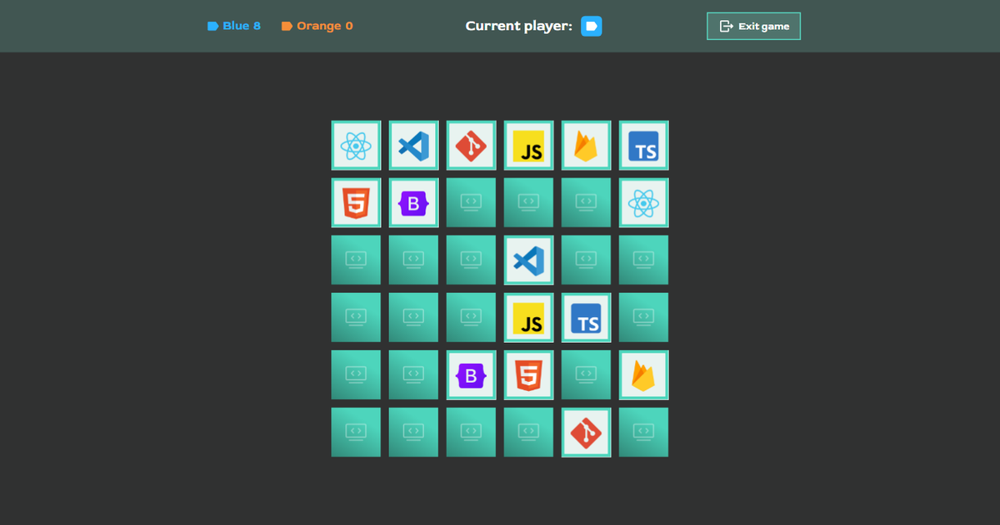
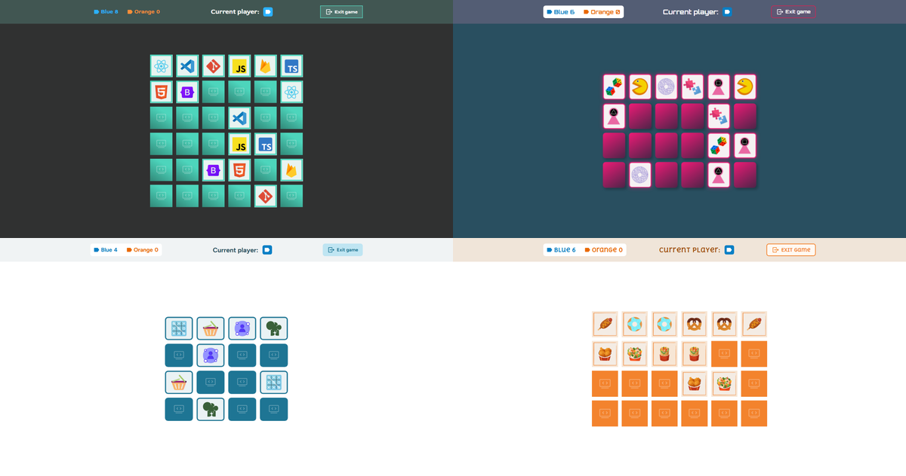
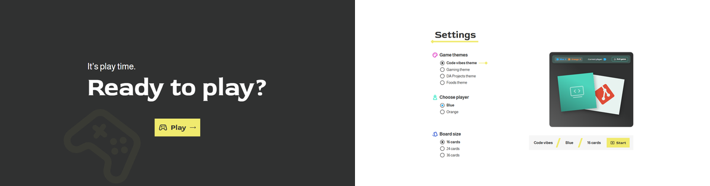
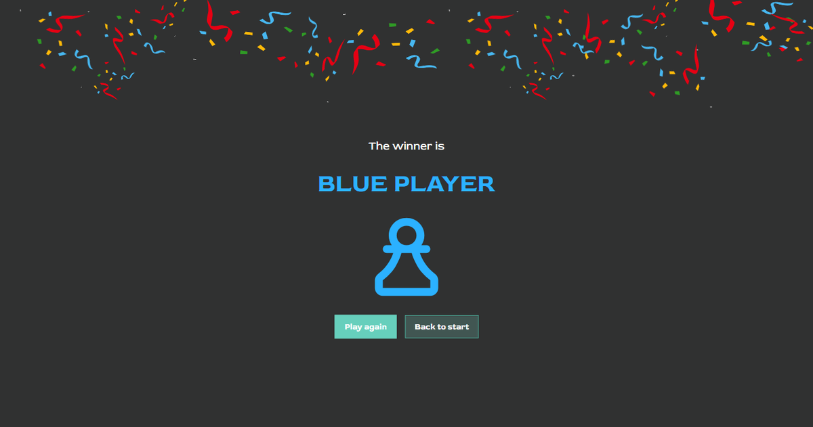

# Memory

A memory card game for two players sharing one screen. Four themes, three board
sizes, score keeping with alternating turns and a winner screen of its own.
Written in TypeScript and SCSS, built with Vite – no framework, no runtime
dependencies.

**[▶ Play it](https://alexander-lindt.developerakademie.net/Memory/)**



## How it plays

Two players take turns flipping two cards each. A matching pair scores a point
and the same player goes again. If the cards do not match they turn back over
after 1.4 seconds and the other player takes over. Once every pair is found the
final score appears, followed by the winner.

## Four themes

Each theme brings its own typeface, colour scheme, card back and a set of 18
motifs – so the choice changes not just how the game looks, but what the cards
are about.



From top left: **Code vibes** (developer tools), **Gaming** (classic games),
**DA Projects** (Developer Akademie projects), **Foods** (food).

## Before the round

The settings screen is where theme, player colour and board size are picked.
The preview on the right shows the chosen theme right away – and hovering a
theme row shows that theme's design before it is even clicked.



## At the end



First the final score on its own "Game over" screen, then the winner by name
with the playing piece in their colour. A click skips the pause in between. A
draw is handled separately and gets a pair of scales instead of the piece.

## Features

| | |
|---|---|
| **Players** | Two – Blue and Orange; the choice decides who starts |
| **Board sizes** | 16 (4×4), 24 (6×4) and 36 (6×6) cards |
| **Themes** | Four, each with its own typeface, palette and set of motifs |
| **Card animation** | 3D flip over 0.55 s |
| **End of round** | Final score, then a winner screen with confetti |
| **New round** | "Play again" starts over immediately, "Back to start" returns home |
| **Leaving** | "Exit game" asks in a dialog before discarding the round |
| **Input** | Everything is a real `<button>`, so the keyboard works throughout |
| **Screen sizes** | Fully playable from 320 px to 2560 px |

## Getting started

```bash
npm install      # once
npm run dev      # dev server with hot reload
npm run build    # type check + production build into dist/
npm run preview  # serve the finished build locally
```

`npm run build` runs `tsc --noEmit` first: if the type check finds an error, no
build is produced at all. The result lands in `dist/` and is uploaded to the
server unchanged.

## Layout of the project

```
index.html              All five screens + quit dialog, loads src/main.ts
src/main.ts             Entry point: styles, event wiring, start
src/config.ts           4 themes, players, board sizes, timings
src/types.ts            Shared types (Theme, Card, GameState …)
src/state.ts            Central game state
src/dom.ts              Typed DOM lookups
src/screens.ts          Screen routing and quit dialog
src/stage.ts            Scaling of the design canvas
src/settings.ts         Settings: selection, preview, summary
src/board.ts            Deck building (Fisher-Yates) and card DOM
src/game.ts             Flipping, matching, scoring, turn changes
src/end.ts              Game over screen, winner display, confetti
src/styles/style.scss   Main stylesheet, pulls in the partials
src/styles/_*.scss      One partial per screen + variables and theme tokens
public/                 75 images and the favicon, copied as they are
vite.config.ts          base: '/Memory/' – the project lives in a subfolder
tsconfig.json           strict: true
```

The five screens – home, settings, board, "Game over" and winner – all live in
the same document and are shown and hidden through `hidden`. There is never a
reload.

## Technical decisions

### TypeScript

`strict: true`, and the build stops at any type error. Instead of loose strings,
dedicated types describe what is allowed – `PlayerId` is `'blue' | 'orange'`,
`BoardSize` is `16 | 24 | 36`. A typo in a theme id therefore shows up at build
time rather than in the browser.

Two places needed a solution of their own, because the modules would otherwise
have imported each other in a circle: the board passes clicks upwards through a
callback (`FlipHandler`) instead of importing the round logic, and the screen
routing lives in `screens.ts` rather than in the entry point.

`document.getElementById` returns `HTMLElement | null`. Under `strict` every
single lookup would need its own null check, so `byId()` in `dom.ts` does that
once centrally and throws on a missing id – a typo in the markup should surface,
not be quietly passed over.

### SCSS

`style.scss` pulls in one partial per screen (`_home`, `_settings`, `_board` …),
plus `_themes` with the colour tokens and `_responsive` with the media queries.
Measurements and breakpoints sit once in `_variables.scss` instead of scattering
a breakpoint number across nine media queries.

The themes are nothing but CSS variables on `body[data-theme]`. Switching a
theme means setting an attribute – no rebuild, nothing reloaded. The preview on
the settings screen carries its theme itself for the same reason, so it can show
a theme that has not been chosen yet.

### Images

All 75 images sit unchanged in `public/` and are copied into `dist/` as they are
at build time. If a file is missing, the card falls back to a matching symbol –
the game stays playable either way.

## Behaviour across screen sizes

The game is fully playable at any width from 320 px to 2560 px. From the bottom
up, these ranges dovetail into one another:

| Range | Behaviour |
|---|---|
| **up to 400 px** | Tighter spacing throughout, and the game bar moves close to the top edge so the board gets as much room as possible. |
| **up to 560 px** | The summary on the settings screen no longer fits on one line: theme, player and size keep their shared line, "Start" moves below it, centred. |
| **up to 768 px** | Proper flow layout: the canvas turns static, every screen is a flex container over `min-height: 100vh`. Font sizes and spacing scale via `clamp()`, the board runs as `repeat(var(--cols), 1fr)` with `aspect-ratio` cards. The board is capped twice – by the screen width and by the height left below the bar – so it never runs off the bottom; the 24-card board stands upright as 4 × 6 instead of 6 × 4. The game bar becomes two lines and runs edge to edge as a surface, while its content stays as wide as the board. |
| **769 – 1439 px** | The fixed 1440 × 1024 design canvas is scaled down via `transform: scale()` – every distance stays pixel-exact as drawn. It is scaled to 1260 px in width, the area the design actually fills; only the empty side margins run past the screen edge. In height the full 1024 px remain, otherwise the top edge would grow tighter the shorter the window gets and the content would appear to drift upwards. |
| **1440 px and up** | The content area keeps its width and is centred while the background runs across the whole screen – in every theme with its own colour. From here on the winner screen uses the long confetti strip (3216 px, 22 pieces) instead of the shorter one. |

Every screen (home, settings, the board in all three sizes, quit dialog, game
over, winner, draw) was checked in all four themes at 320, 375, 480, 560, 760,
768, 900, 1024, 1440, 2560 and 3440 px.

## Code conventions

HTML, SCSS and TypeScript live in separate files. No inline styles, no inline
event handlers. Every function carries a JSDoc block, stays under 15 lines and
does exactly one thing. Names in camelCase, constants in UPPER_SNAKE_CASE,
semantic elements and `alt` attributes throughout.
